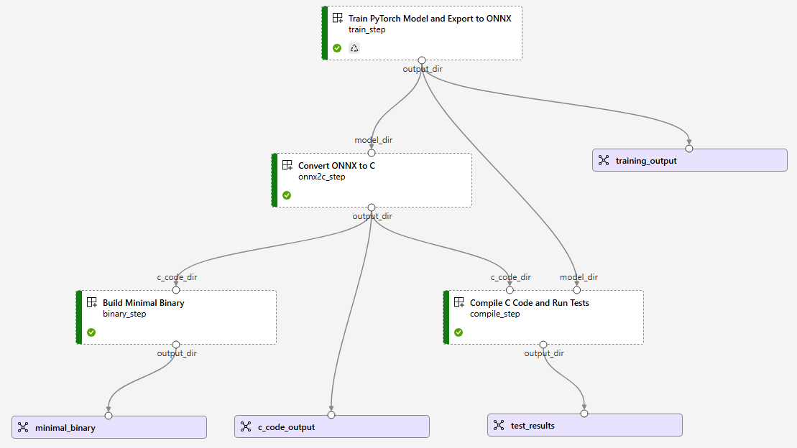

# Azure ML Pipeline for PyTorch, ONNX, and C Compilation

This repository contains a Azure ML pipeline implementation for:
1. Training a PyTorch model
2. Exporting to ONNX format
3. Converting ONNX to C code using onnx2c
4. Compiling and testing the C code
5. Building a minimal binary for deployment



## Project Structure

```
.
├── README.md
├── diagrams
├── environments
│   ├── gcc
│   │   └── Dockerfile
│   ├── onnx2c
│   │   └── Dockerfile
│   └── pytorch
│       ├── Dockerfile
│       └── requirements.txt
├── requirements.txt
├── setup_pipeline.py
└── src
    ├── compile_test
    │   ├── run.py
    │   └── templates
    │       ├── model_impl.c
    │       ├── test_model.c
    │       └── time_series_model.h
    ├── minimal_binary
    │   ├── README.md
    │   ├── binary-size-guide.md
    │   ├── run.py
    │   └── templates
    │       ├── README.md
    │       ├── compile_minimal.sh
    │       ├── minimal_example.c
    │       ├── model_impl.c
    │       ├── nn_wrapper.h
    │       └── time_series_model.h
    ├── onnx2c
    │   └── run.py
    └── pytorch_train
        └── run.py
```

## Prerequisites

- Azure ML workspace
- Azure CLI installed
- Python environment with the following packages:
  - azure-ai-ml
  - azure-identity

## Setup Instructions

1. Clone this repository
2. Update `setup_pipeline.py` with your Azure ML workspace details (current setup uses a `.env` file)
3. Run the setup script:

```bash
# Set up the pipeline without running it
python setup_pipeline.py

# Or set up and immediately run the pipeline
python setup_pipeline.py --run
```

The `--run` flag will submit the pipeline job to Azure ML immediately. Without this flag, the setup script will only prepare the pipeline but not execute it.

## Pipeline Components

### 1. PyTorch Training

- Trains a simple time series neural network using PyTorch
- Exports the model to ONNX format
- Saves test data for later validation

### 2. ONNX to C Conversion

- Uses onnx2c to convert the ONNX model to C code
- Creates additional C files needed for compilation and testing

### 3. C Compilation and Testing

- Compiles the C code generated from the model
- Runs tests using the test data saved during training
- Saves test results for analysis

### 4. Minimal Binary Build

- Creates a minimal binary suitable for embedded deployment
- Optimizes for size using compiler flags
- Provides memory usage statistics

## Environment Details

### PyTorch Environment

Contains PyTorch and all dependencies needed for training and ONNX export.

### ONNX2C Environment

Contains the onnx2c tool built from source, which converts ONNX models to C code.

### GCC Environment

Contains GCC and tools needed to compile and test the C code.

## Pipeline Outputs

The pipeline produces several artifacts:

1. **Training Output**
   - ONNX model
   - Test data (CSV files)
   - Training metrics and visualizations

2. **C Code Output**
   - Generated C code from the ONNX model
   - Supporting C files for compilation

3. **Test Results**
   - Test output showing prediction accuracy
   - Compiled test binary

4. **Minimal Binary**
   - Optimized binary for deployment
   - Size and memory usage statistics

## Customization

To adapt this pipeline for your own models:

1. Modify `src/pytorch_train/run.py` to train your specific model
2. Adjust the C wrapper code in `src/onnx2c/run.py` if your model has a different interface
3. Update compilation settings in `src/minimal_binary/run.py` for your target platform

## Troubleshooting

- Check the logs for each pipeline step in the Azure ML Studio UI
- Ensure all environments are correctly built before running the pipeline
- Verify that the ONNX model is compatible with onnx2c (not all ONNX operations are supported)

## License

[MIT License](LICENSE)
